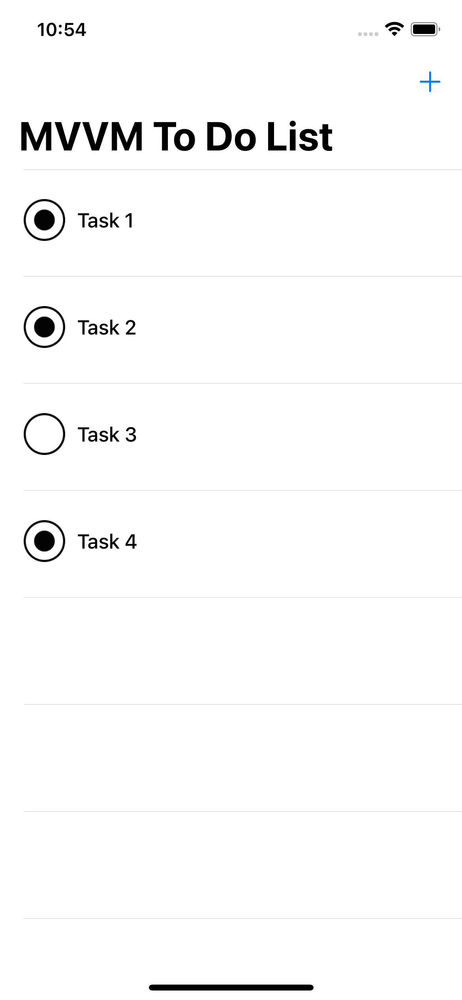
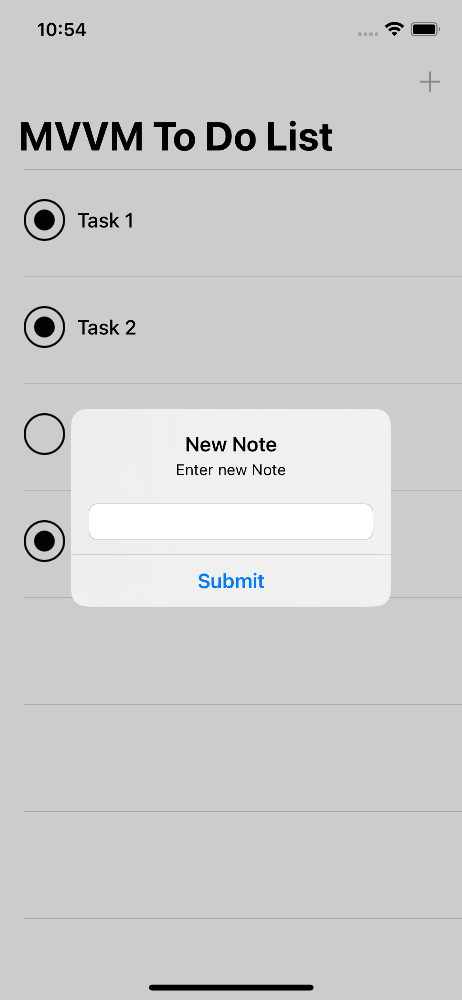
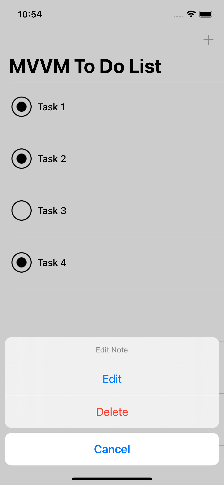

# TodoList
A simple todo list

> Todo List app allows users to organize thier tasks, and track which task is done.

The purpose of this project is to show the difference between MVC and MVVM. By migrating a TODO app from MVC to MVVM.

# MVVM TODO App

This Project developed in swift 5 using MVVM architecture design pattern. The app allows users to organize thier tasks, and track which task is done.

# What is MVVM ?

Model–view–viewmodel (MVVM) is a software architectural pattern that facilitates the separation of the development of the graphical user interface (the view) – be it via a markup language or GUI code – from the development of the business logic or back-end logic (the model) so that the view is not dependent on any specific model platform. The view model of MVVM is a value converter,[1] meaning the view model is responsible for exposing (converting) the data objects from the model in such a way that objects are easily managed and presented. In this respect, the view model is more model than view, and handles most if not all of the view's display logic.[1] The view model may implement a mediator pattern, organizing access to the back-end logic around the set of use cases supported by the view.[https://en.wikipedia.org/wiki/Model–view–viewmodel]

# Screenshot

